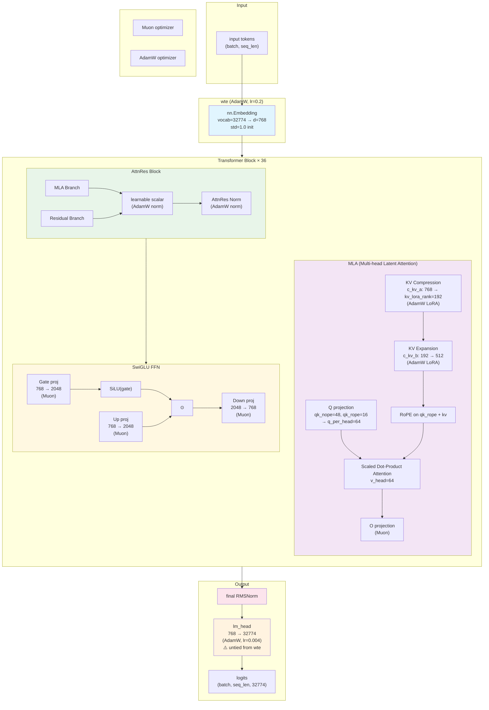

# GPT_v2 Architecture (277.8M)



## Parameter Breakdown

| Component | Params | Optimizer | LR |
|-----------|--------|-----------|-----|
| wte (Embedding) | 32774 × 768 = 25.2M | AdamW | 0.2 |
| MLA (c_kv_a + c_kv_b) | 768×192 + 192×512 ≈ 0.25M | AdamW (LoRA) | — |
| MLA (Q, O, other) | — | Muon | — |
| SwiGLU (gate+up+down) × 36 | 3 × 768 × 2048 × 36 ≈ 169.9M | Muon | — |
| AttnRes (scalar + norm) × 18 | small | AdamW (norm) | — |
| lm_head | 768 × 32774 = 25.2M | AdamW | 0.004 |
| **Total** | **~277.8M** | | |

## Key Design Decisions

```
tie_lm_head = False  ← 关键！wte 和 lm_head 各学各的
                      避免 final RMSNorm + tied 导致的 logit 饱和

final RMSNorm        ← 稳定 hidden scale，但必须配合 untied head

混合 Optimizer        ← Muon 处理方阵投影（收敛快）
                      AdamW 处理非方阵 + embedding + norm
```

## Removed from v1 (758M)

```
✗ VE (Vocabulary Embedding) × 18 layers  →  -453M params
  每个 layer 独立的 vocab-level embedding 投影
```
